# Ex-08-Data-Visualization-

## AIM
To Perform Data Visualization on a complex dataset and save the data to a file. 

# Explanation
Data visualization is the graphical representation of information and data. By using visual elements like charts, graphs, and maps, data visualization tools provide an accessible way to see and understand trends, outliers, and patterns in data.

# ALGORITHM
### STEP 1
Read the given Data
### STEP 2
Clean the Data Set using Data Cleaning Process
### STEP 3
Apply Feature generation and selection techniques to all the features of the data set
### STEP 4
Apply data visualization techniques to identify the patterns of the data.


# CODE
## DATA PREPROCESSING

```
import pandas as pd
import numpy as np
import matplotlib.pyplot as plt
import seaborn as sns
from google.colab import files
uploaded = files.upload()
df = pd.read_csv("tips.csv")
df

```
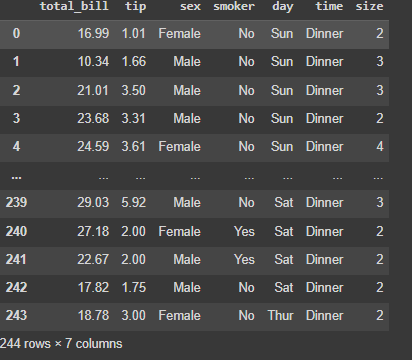

```
df.isnull().sum()
```

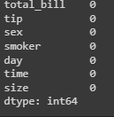

## FINDING OUTLIERS
```
plt.figure(figsize=(8,8))
plt.title("Data with outliers")
df.boxplot()
plt.show()
```
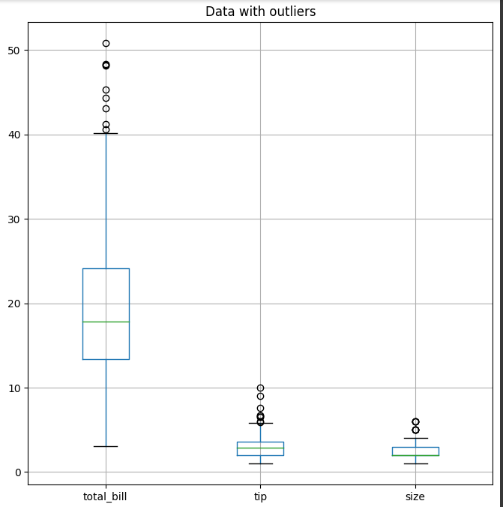


## REMOVING OUTLIERS
```
plt.figure(figsize=(8,8))
cols = ['size','tip','total_bill']
Q1 = df[cols].quantile(0.25)
Q3 = df[cols].quantile(0.75)
IQR = Q3 - Q1
df = df[~((df[cols] < (Q1 - 1.5 * IQR)) |(df[cols] > (Q3 + 1.5 * IQR))).any(axis=1)]
plt.title("Dataset after removing outliers")
df.boxplot()
plt.show()
```
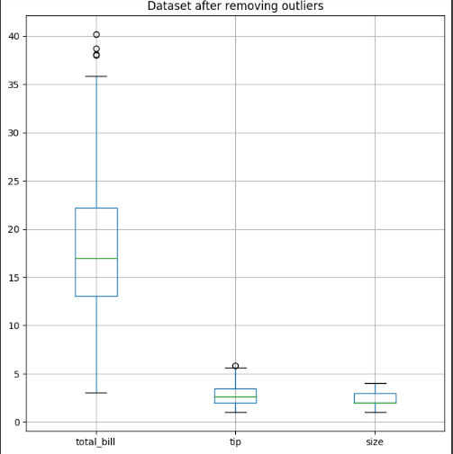

## 1.Which day of the week has the highest total bill amount?
```
sns.barplot(x="day", y="total_bill", data=df)
plt.title("Total Bill Amount by Day of Week")
plt.show()
```
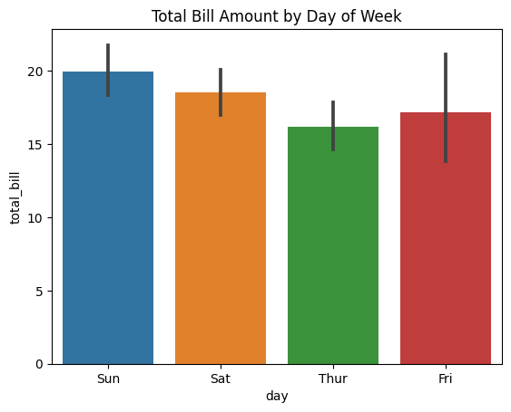

## 2.What is the average tip amount given by smokers and non-smokers?
```
sns.boxplot(x="smoker", y="tip", data=df)
plt.title("Tip Amount by Smoking Status")
plt.show()
```
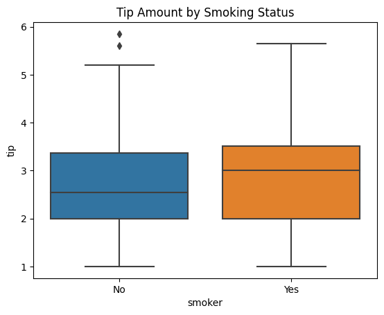

## 3.How does the tip percentage vary based on the size of the dining party?

```
df["tip_pct"] = df["tip"] / df["total_bill"]
sns.scatterplot(x="size", y="tip_pct", data=df)
plt.title("Tip Percentage by Dining Party Size")
plt.show()
```
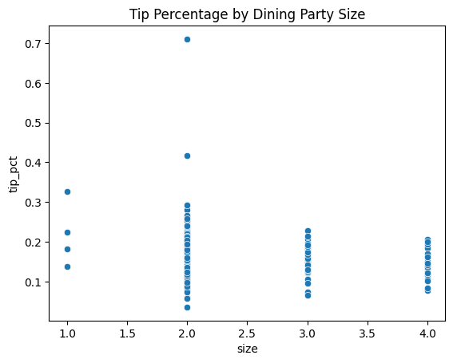

## 4.Which gender tends to leave higher tips?
```
sns.boxplot(x="sex", y="tip", data=df)
plt.title("Tip Amount by Gender")
plt.show()
```
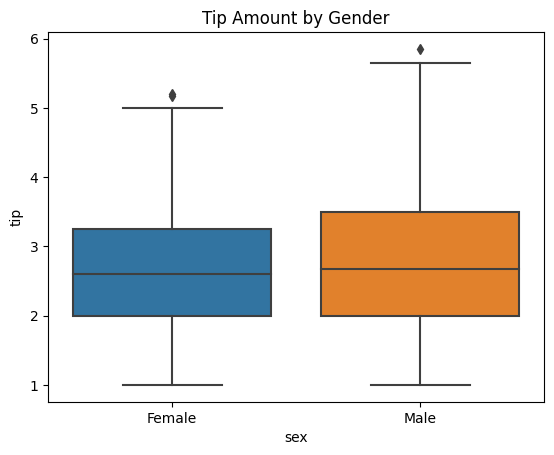

## 5.Is there any relationship between the total bill amount and the day of the week?

```
sns.scatterplot(x="day", y="total_bill", data=df)
plt.title("Total Bill Amount by Day of Week")
plt.show()
```
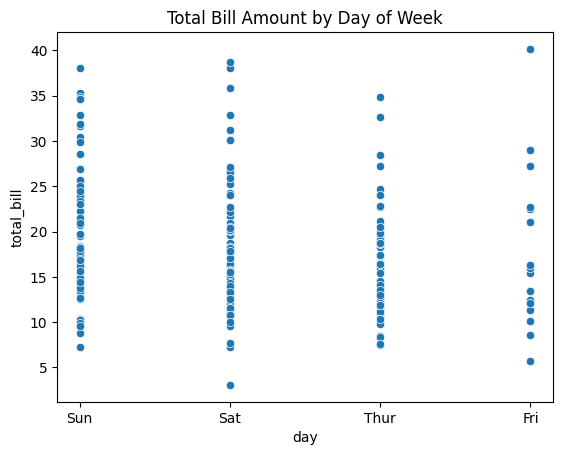

## 6.How does the distribution of total bill amounts vary across different time periods (lunch vs. dinner)?
```
sns.histplot(data=df, x="total_bill", hue="time", element="step", stat="density")
plt.title("Distribution of Total Bill Amounts by Time of Day")
plt.show()
```
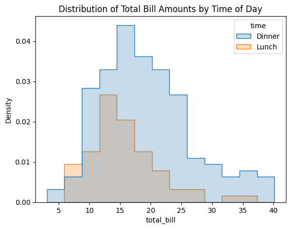

## 7.Which dining party size group tends to have the highest average total bill amount?
```
sns.barplot(x="size", y="total_bill", data=df)
plt.title("Average Total Bill Amount by Dining Party Size")
plt.show()
```
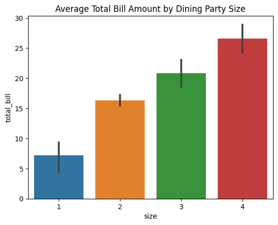

## 8.What is the distribution of tip amounts for each day of the week?
```
sns.boxplot(x="day", y="tip", data=df)
plt.title("Tip Amount by Day of Week")
plt.show()
```
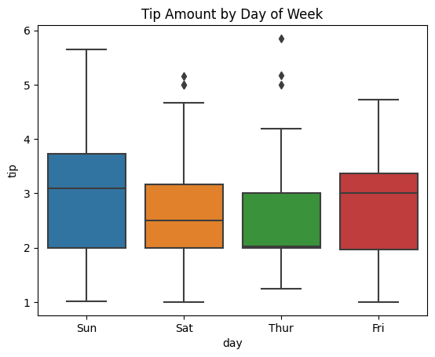

## 9.How does the tip amount vary based on the type of service (lunch vs. dinner)?
```
sns.violinplot(x="time", y="tip", data=df)
plt.title("Tip Amount by Time of Day")
plt.show()
```
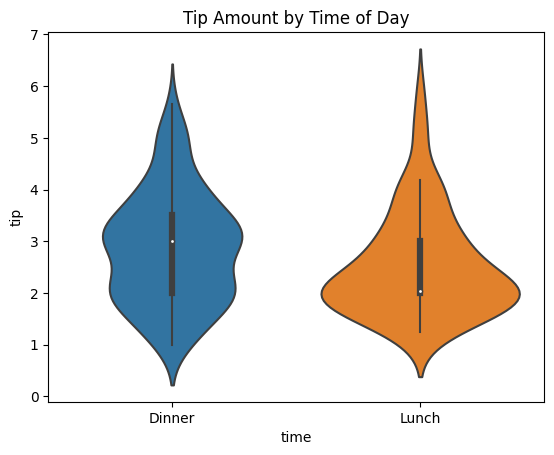

## 10.Is there any correlation between the total bill amount and the tip amount?
```
sns.scatterplot(x="total_bill", y="tip", data=df)
plt.title("Correlation between Tip Amount and Total Bill Amount")
plt.show()
```
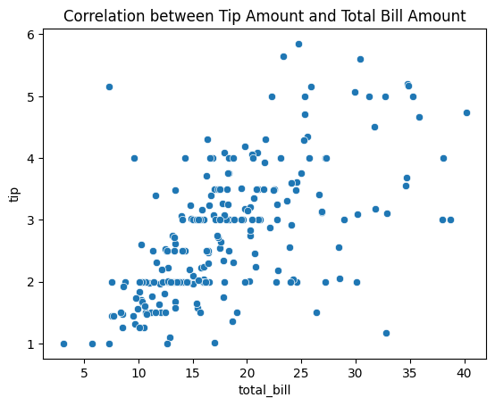

## Result:
Thus, Data Visualization is performed on the given dataset and save the data to a file.

